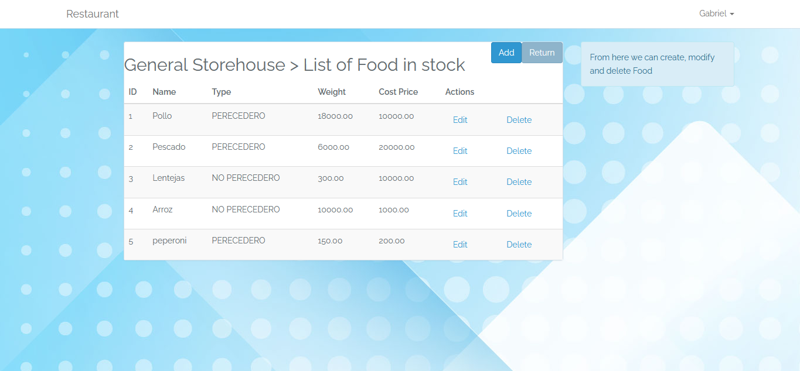
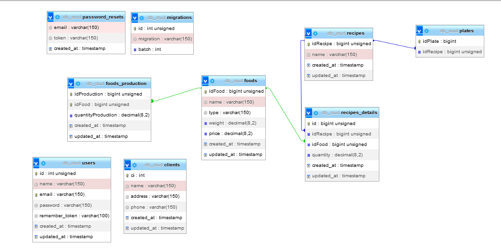

# Project Title

Restaurant Kitchen Management System

## Authors

- [@gabrielcarrillosoftware](https://github.com/gabrielcarrillosoftware)


## Tech Stack

**Client:**  Vuejs 2, Blade, Jquery, Css, Html

**Server:** PHP 7, Laravel 5.5


## Installation

Install my-project with these commands, you need to be insade of the folder of the project:
```bash
  composer install 
  php artisan generate:key
```
You need to create a database called `kitchedb` in your database management software, in my case I used mysql with phpmyadmin.

Next you need to create an `.env` file and write the values ​​found in the next section    
## Environment Variables

To run this project, you will need to add the following environment variables to your .env file

`APP_NAME=Restaurant`
`APP_ENV=local`
`APP_KEY=base64:+S1VrY+9xy7rqrRIALD9HY8V3v/zmGWVq9O3FczZSEU=`
`APP_DEBUG=true`
`APP_LOG_LEVEL=debug`
`APP_URL=http://localhost`

`DB_CONNECTION=mysql`
`DB_HOST=127.0.0.1`
`DB_PORT=3306`
`DB_DATABASE=kitchendb`
`DB_USERNAME=root`
`DB_PASSWORD=`

`BROADCAST_DRIVER=log`
`CACHE_DRIVER=file`
`SESSION_DRIVER=file`
`QUEUE_DRIVER=sync`

`REDIS_HOST=127.0.0.1`
`REDIS_PASSWORD=null`
`REDIS_PORT=6379`

`MAIL_DRIVER=smtp`
`MAIL_HOST=smtp.mailtrap.io`
`MAIL_PORT=2525`
`MAIL_USERNAME=null`
`MAIL_PASSWORD=null`
`MAIL_ENCRYPTION=null`

`PUSHER_APP_ID=`
`PUSHER_APP_KEY=`
`PUSHER_APP_SECRET=`

## Deployment

To deploy this project run

```bash
  php artisan serve
```

You can login with the following test user:

User: gabrielcarrillosoftware@gmail.com
Password: admin
## Screenshots

- Home 


- Login


- Welcome


- Customers


- General Storehouse


-Recipe


-Kitchen


- Entity Relationship Diagram



## 🛠 Skills
PHP, Laravel, Javascript, HTML, CSS, VueJs, Bootstrap 3...


## License

[MIT](https://choosealicense.com/licenses/mit/)

